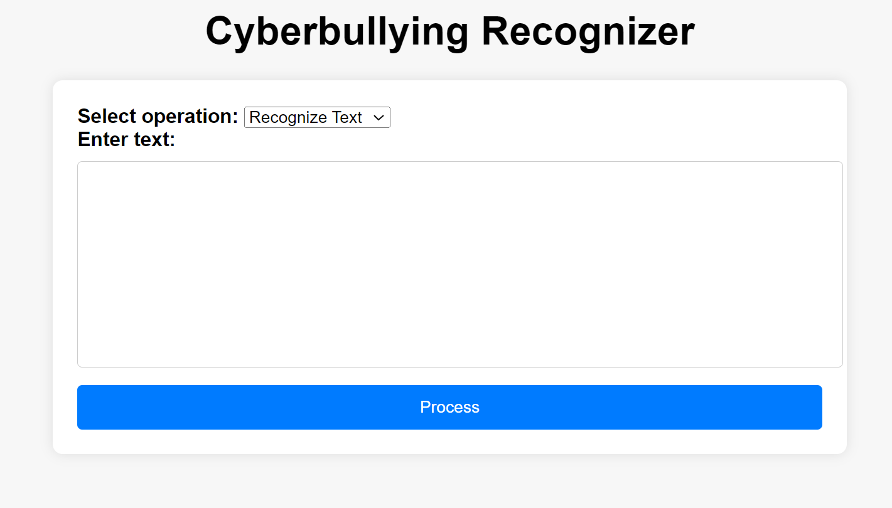
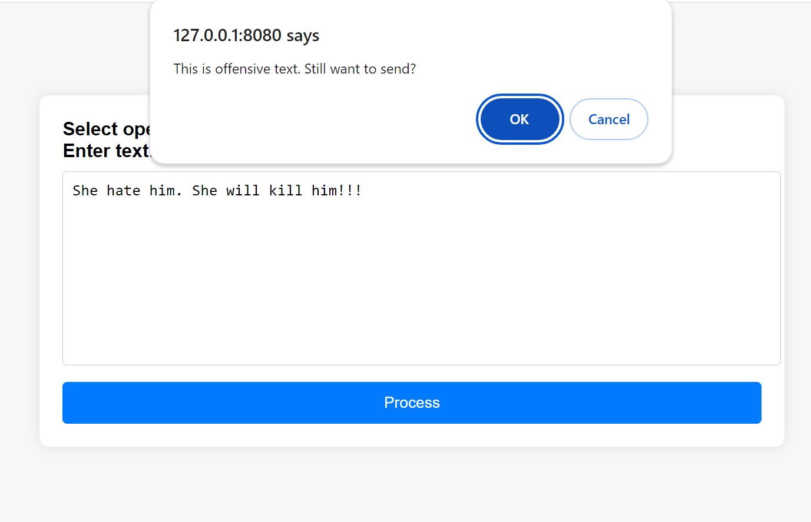

# Cyberbullying_Recognizer_and_Summarizer

## Software And Tools Requirements

1. [Github Account](https://github.com)
2. [VSCodeIDE](https://code.visualstudio.com/)
3. [GitCLI](https://git-scm.com/book/en/v2/Getting-Started-The-Command-Line)
4. [Flask](https://flask.palletsprojects.com/en/3.0.x/)
5. [Docker](https://www.docker.com/)

<!DOCTYPE html>
<html lang="en">
<head>
  <meta charset="UTF-8">
  <meta name="viewport" content="width=device-width, initial-scale=1.0">
  <title>Cyberbullying Detection Project</title>
</head>
<body>
  <h1>Cyberbullying Detection Project</h1>

  

    <h2>Introduction</h2>
    

      This project aims to address the prevalent issue of cyberbullying, which has become a significant concern globally, including in India, as reported by the National Crime Records Bureau (NCRB). Research indicates that individuals tend to reconsider their actions when made aware of their offensive behavior, with a success rate of up to 90%.
    

    

      To tackle this problem, this project focuses on developing a solution that can detect offensive text and prompt users with a popup notification, providing them with the opportunity to reconsider their actions.
    

  

  

    <h2>Project Overview</h2>
    <h3>Module 1: Data Extraction, Transformation, and Loading (ETL)</h3>
    <ul>
      <li>Extraction: Data is obtained from Kaggle, focusing on datasets related to cyberbullying.</li>
      <li>Transformation: Data is processed and transformed into a suitable format, leveraging Python and libraries such as Pandas.</li>
      <li>Loading: Transformed data is loaded into Pandas DataFrames for further processing.</li>
      <li>Exploratory Data Analysis (EDA): Descriptive statistics are employed to assess the suitability of the dataset for addressing the problem statement.</li>
      <li>NLP Model Creation: Utilizing Spacy, a Natural Language Processing (NLP) model is developed to detect offensive text.</li>
    </ul>
    <h3>Module 2: Machine Learning Models for Detection</h3>
    <ul>
      <li>Feature Extraction: Count Vectorizer is utilized to extract features from the text data.</li>
      <li>Model Implementation: Decision Trees, Random Forest, Support Vector Machines (SVM), and Gradient Boosting Machines (GBM) are implemented to detect cyberbullying data.</li>
      <li>Performance: Random Forest achieves the highest accuracy of 89%.</li>
    </ul>
    <h3>Module 3: Web API Development and Deployment</h3>
    <ul>
      <li>Web API Development: A Flask-based Web API is developed to provide an interface for text processing.</li>
      <li>Model Deployment: The NLP model is containerized using Docker for seamless deployment.</li>
      <li>Integration: The functionality can be integrated into various social media platforms to aid in combating cyberbullying.</li>
    </ul>
  

  

    <h2>User Interface</h2>
    

      
    

    

      
    

  

  

    <h2>Additional Functionality: Text Summarization</h2>
    
In addition to offensive text detection, the project includes functionality for text summarization, enhancing its utility for various applications.

  

  

    <h2>Usage</h2>
    
To utilize the project:

    <ol>
      <li>Clone the repository.</li>
      <li>Install the necessary dependencies.</li>
      <li>Run the Flask-based Web API.</li>
      <li>Integrate the functionality into the desired platform or application.</li>
    </ol>
  

  

    <h2>Contributors</h2>
    
[Your Name]: Project Lead and Developer

  

  

    <h2>License</h2>
    
This project is licensed under the <a href="LICENSE">MIT License</a>.

  

  

    <h2>Acknowledgments</h2>
    <ul>
      <li>National Crime Records Bureau (NCRB) for highlighting the issue of cyberbullying.</li>
      <li>Kaggle for providing datasets for analysis.</li>
      <li>Libraries and frameworks used in the development of this project.</li>
    </ul>
  

</body>
</html>
